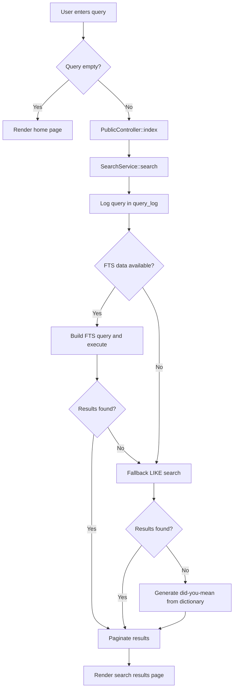
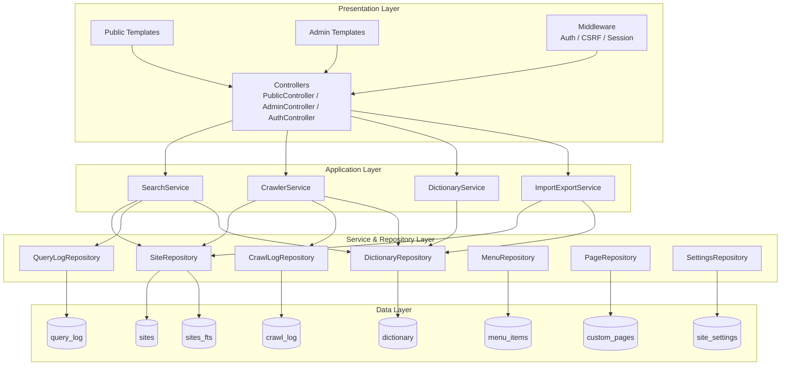
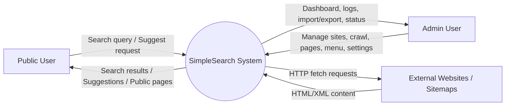
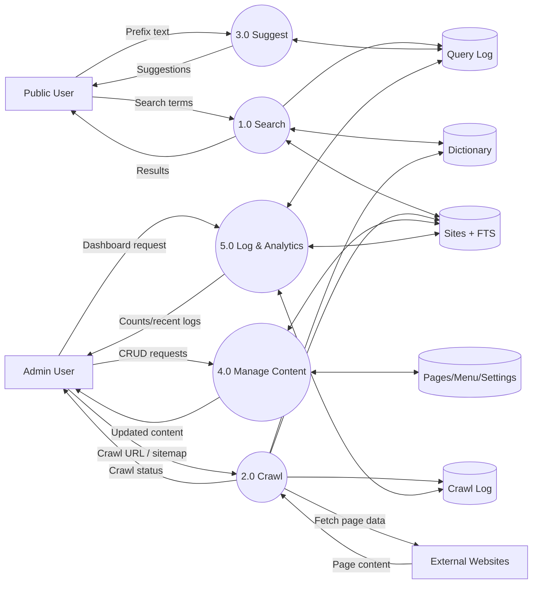
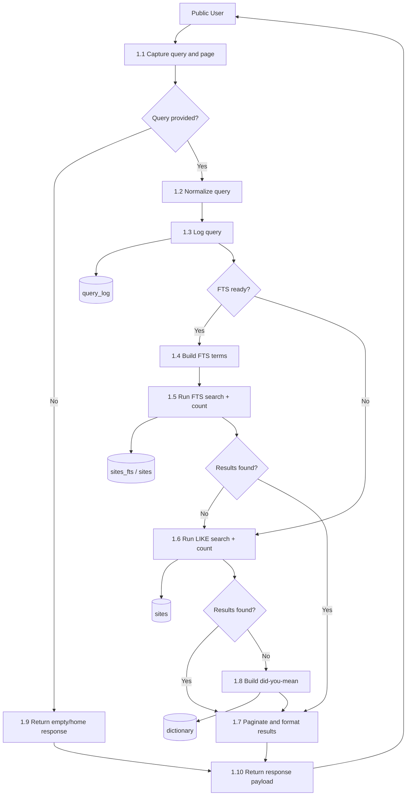
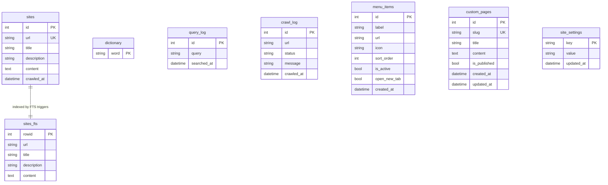
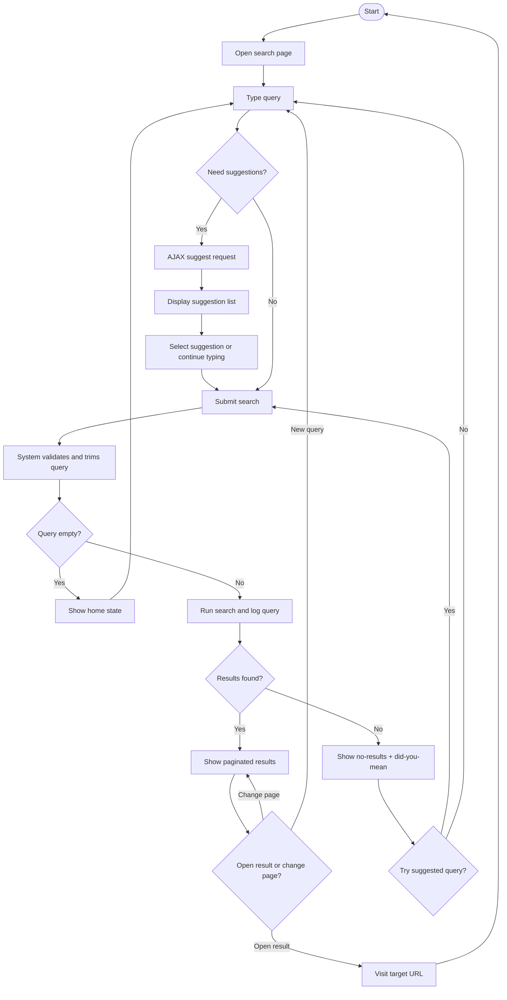

# SimpleSearch System Diagrams

The following diagrams describe the current SimpleSearch architecture and workflows.

## 1) Flow Chart — Query to Results

## 2) Block Diagram — Layered Architecture

## 3) DFD Level 0 — Context Diagram

## 4) DFD Level 1 — Major Processes

## 5) DFD Level 2 — Decomposition of Search Process (1.0)

## 6) ER Diagram — Database Schema

## 7) Activity Diagram — User Search Flow

